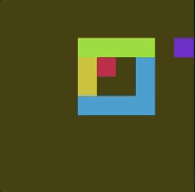
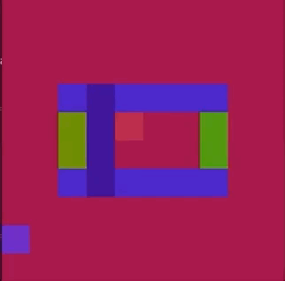

# Gym Tool-Use

Gym tool-use environments.

<hr/>

```sh
$ git clone https://github.com/fomorians/gym_tool_use.git
$ (cd gym_tool_use; pip install -e .)
```

# Examples So Far

<p align="center">
  <p align="center">
    
  </p>
  <p align="center"><i>Perceptual</i></p>
  <p align="center">
    
  </p>
  <p align="center"><i>Structural</i></p>
</p>

# Development

Development is started with `pipenv`.

```sh
$ pipenv install
$ pipenv shell
```
