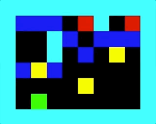

# Gym Tool-Use

Gym tool-use environments.

<hr/>

```sh
$ git clone https://github.com/fomorians/gym_tool_use.git
$ (cd gym_tool_use; pip install -e .)
```

# Environments

## Bridge Building

<p align="center">
    
</p>

### `gym.make('BridgeBuilding-v{0,1,2}')`

The first- and second- level (`v0`, `v1`)force agents to learn how to interact with the environment. The third level (`v2`) tests the ability of agents to use objects to alter the environment in order to accomplish the goal. Agents won't explicitly learn to use tools in the first- and second-levels (this is used as a training set), unless they learn the relationship between the box and the water. Only during evaluation is an agent supposed to use this learned relationship to accomplish the complicated task (you can think of it similar to sokoban)

## Example:

```python
import gym
import gym_tool_use

env = gym.make('BridgeBuilding-v0')
state = env.reset()
total_reward = 0.
env.render()

actions = [0, 0, 0, 3, 3, 0, 3, 3, 0, 3, 3, 3]

for action in actions:
    _, reward, _, _ = env.step(action)
    total_reward += reward
    env.render()
env.close()
print('Total reward = {}'.format(total_reward))
# >>> 1.
```

## Testing

```sh
$ python -m gym_tool_use.bridge_building_test
```

# Development

Development is started with `pipenv`.

```sh
$ pipenv install
$ pipenv shell
```

