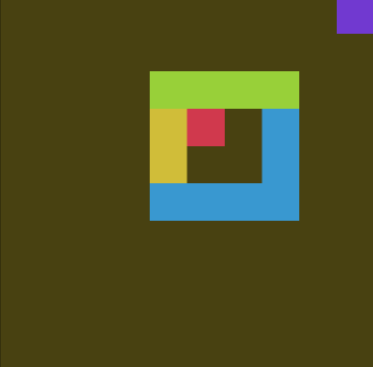
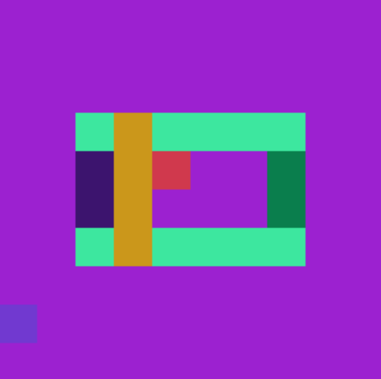
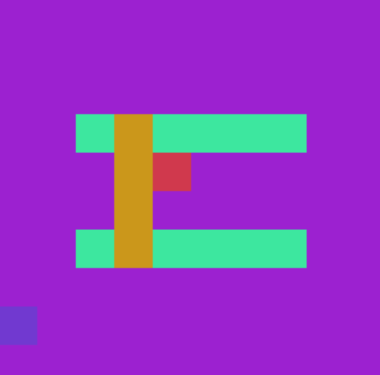
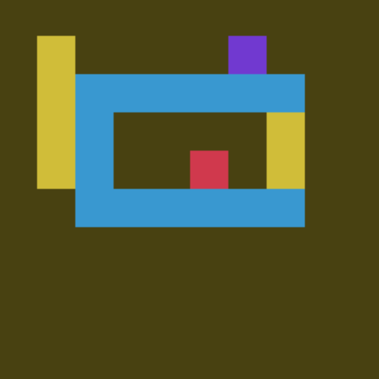
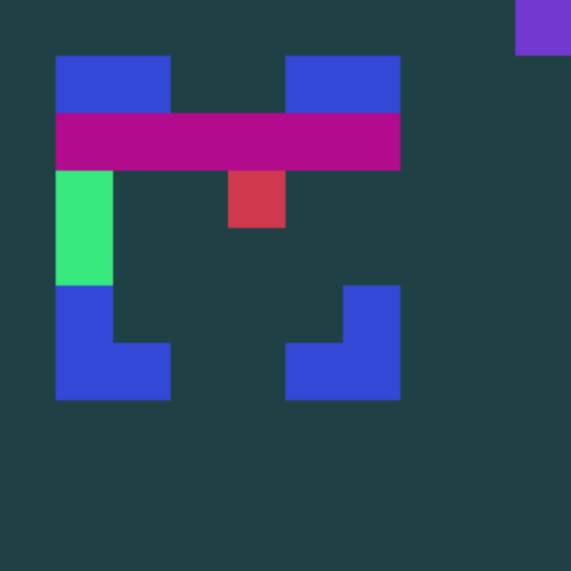
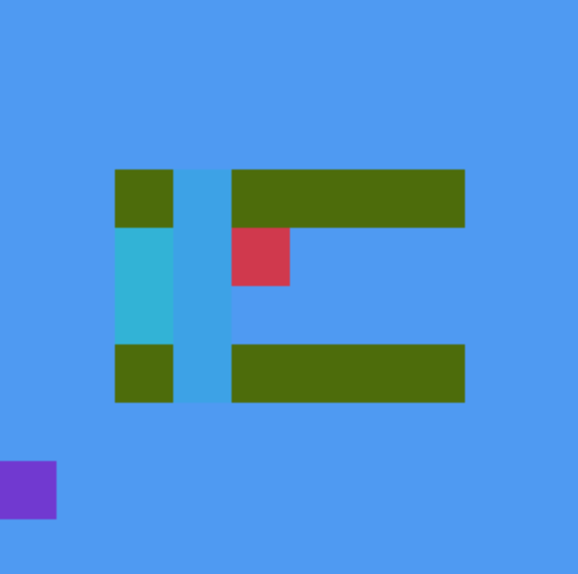

# Gym Tool Use

Gym tool use environments.

<hr/>

```sh
$ git clone https://github.com/fomorians/gym_tool_use.git
$ (cd gym_tool_use; pip install -e .)
```

# Showcase

| | | |
| :---: | :---: | :---: |
|  <br> perceptual |  <br> structural |  <br> symbolic |
|  <br> perceptual_symbolic |  <br> perceptual_structural |  <br> structural_symbolic |
| |  <br> perceptual_structural_symbolic | |

# Development

Development is started with `pipenv`.

```sh
$ pipenv install
$ pipenv shell
```
